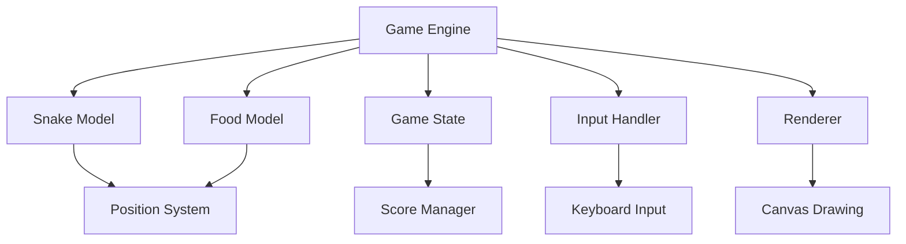

# 设计文档

## 概述

贪吃蛇游戏将使用HTML5 Canvas和JavaScript实现，采用面向对象的设计模式。游戏将包含游戏引擎、渲染系统、输入处理和游戏状态管理等核心组件。

## 架构

游戏采用MVC（Model-View-Controller）架构模式：

- **Model（模型）**：游戏状态、蛇对象、食物对象、分数系统
- **View（视图）**：Canvas渲染器、UI显示
- **Controller（控制器）**：输入处理、游戏循环、状态管理



## 组件和接口

### 1. 游戏引擎 (GameEngine)

```javascript
class GameEngine {
    constructor(canvasId)
    start()
    pause()
    resume()
    reset()
    gameLoop()
    update()
    render()
}
```

### 2. 蛇模型 (Snake)

```javascript
class Snake {
    constructor(x, y)
    move()
    changeDirection(direction)
    grow()
    checkSelfCollision()
    getHead()
    getBody()
}
```

### 3. 食物模型 (Food)

```javascript
class Food {
    constructor()
    generatePosition(snakeBody)
    getPosition()
    isEaten(snakeHead)
}
```

### 4. 游戏状态 (GameState)

```javascript
class GameState {
    constructor()
    getScore()
    addScore(points)
    isGameOver()
    setGameOver()
    isPaused()
    setPaused(paused)
}
```

### 5. 输入处理器 (InputHandler)

```javascript
class InputHandler {
    constructor(gameEngine)
    bindEvents()
    handleKeyPress(event)
}
```

### 6. 渲染器 (Renderer)

```javascript
class Renderer {
    constructor(canvas)
    clear()
    drawSnake(snake)
    drawFood(food)
    drawScore(score)
    drawGameOver()
    drawPaused()
}
```

## 数据模型

### 位置系统
```javascript
// 坐标系统
const Position = {
    x: number,
    y: number
}

// 方向枚举
const Direction = {
    UP: { x: 0, y: -1 },
    DOWN: { x: 0, y: 1 },
    LEFT: { x: -1, y: 0 },
    RIGHT: { x: 1, y: 0 }
}
```

### 游戏配置
```javascript
const GameConfig = {
    CANVAS_WIDTH: 400,
    CANVAS_HEIGHT: 400,
    GRID_SIZE: 20,
    INITIAL_SPEED: 150, // 毫秒
    SPEED_INCREASE: 5,  // 每吃一个食物减少的毫秒数
    MIN_SPEED: 50       // 最小间隔时间
}
```

### 蛇数据结构
```javascript
const SnakeData = {
    body: [Position], // 蛇身体段数组
    direction: Direction,
    nextDirection: Direction
}
```

## 错误处理

### 1. 输入验证
- 验证方向键输入的有效性
- 防止蛇反向移动
- 处理快速连续按键

### 2. 边界检查
- 检查蛇是否超出游戏区域
- 验证食物生成位置的有效性
- 确保游戏网格对齐

### 3. 状态管理
- 处理游戏暂停/恢复状态冲突
- 管理游戏结束后的状态重置
- 防止重复的游戏循环启动

### 4. 渲染错误
- Canvas上下文获取失败处理
- 处理渲染性能问题
- 确保动画帧的正确清理

## 测试策略

### 1. 单元测试
- **Snake类测试**：移动逻辑、碰撞检测、增长机制
- **Food类测试**：位置生成、碰撞检测
- **GameState类测试**：分数管理、状态切换
- **InputHandler类测试**：键盘输入处理

### 2. 集成测试
- **游戏循环测试**：完整的更新-渲染循环
- **碰撞系统测试**：蛇与食物、蛇与边界、蛇与自身的碰撞
- **状态管理测试**：暂停、恢复、重置功能

### 3. 端到端测试
- **完整游戏流程**：从开始到游戏结束的完整流程
- **用户交互测试**：键盘控制的响应性和准确性
- **性能测试**：游戏在不同速度下的表现

### 4. 测试工具和框架
- 使用Jest进行单元测试
- 使用jsdom模拟DOM环境
- 使用Canvas测试工具验证渲染输出
- 模拟键盘事件进行输入测试

### 5. 测试数据和场景
- 边界条件：蛇长度为1时的行为
- 极限情况：游戏区域几乎被蛇填满
- 性能测试：长时间游戏的内存使用
- 用户体验测试：快速按键的响应